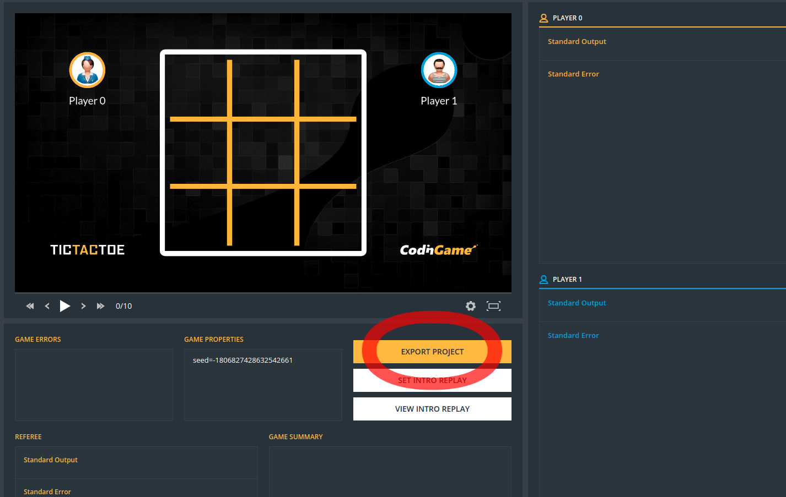

# Getting started

This document will show you, through the simple game "Tic-tac-toe" how to create your own **Multiplayer** game and test it.

The source code is available on GitHub: [https://github.com/CodinGame/game-tictactoe](https://github.com/CodinGame/game-tictactoe)

## Requirements

All you need is a Java IDE such as [Eclipse](https://www.eclipse.org/) or [IntelliJ](https://www.jetbrains.com/idea/) and a git client to clone the example.

⚠ To use the game viewer locally, your browser must support ES6 JavaScript modules. For Chrome, that's version 61 or above. For Firefox, from version 54 this feature is behind the dom.moduleScripts.enabled preference. To change preferences in Firefox, visit about:config.

## Import project

First of all, you need to download the source code of the game:
```
git clone https://github.com/CodinGame/game-tictactoe.git
```

Then, import this project as an existing maven project into your IDE:
- Eclipse: File > Import > Existing Maven Projects
- IntelliJ IDEA: Import Project > Select game-tictactoe > Import project from external model > Maven

## Project Hierarchy

Here's the file hierarchy for the project Tic-tac-toe:
```
.
├── config
│   ├── Boss.java
│   ├── config.ini
│   ├── level1
│   │   └── statement_en.html
│   ├── level2
│   │   └── statement_en.html
│   └── stub.txt
├── pom.xml
├── README.md
├── src
│   ├── main
│   │   ├── java
│   │   │   └── com
│   │   │       └── codingame
│   │   │           └── game
│   │   │               ├── Player.java
│   │   │               └── Referee.java
│   │   └── resources
│   │       └── view
│   │           ├── assets
│   │           │   └── Background.jpg
│   │           └── config.js
│   └── test
│       ├── java
│       │   ├── Main.java
│       │   ├── Player1.java
│       │   └── Player2.java
│       └── resources
│           └── log4j2.properties
```

- **./config:** contains settings such as the statement, number of players, etc.
- **./src/main/java:** source code of the game itself
- **./src/main/resources:** graphical assets and configuration of the view
- **./src/test/java:** classes used for local development (AI codes to test your game)

## Launch the game

The class to run is test/java/Main.java:
- Eclipse: Right click on Main.java > Run As > Java Application
- IntelliJ IDEA: Right click on Main > 'Run Main.main()'

This will launch a [web server](http://localhost:8888/) to serve a page with the viewer of the game.



Use this page to see the rendering of your game. It also allows you to export a zip archive of the game.

## Deploy on codingame

Go to [www.codingame.com](https://www.codingame.com), then click on **Contribute** > **Create** > **Multiplayer Game**.

Then, import on CodinGame the game you have exported during the previous step. The game will be compiled on our servers and a preview link will appear if the compilation succeeded and if the configuration is correct.

## Create Your Own Game

Now that you are able to start a game on your computer and export it to CodinGame, you can start creating your own game. For that, it is suggested you start with the Skeleton: [https://github.com/CodinGame/game-skeleton](https://github.com/CodinGame/game-skeleton)

You can also read the code of others games (see [Examples](playground/misc/misc-2-examples.md)). More advanced documentation is available in the [Core concepts](playground/core-concepts/core-1-introduction.md) section.

If you do not have an artistic mind, we provide a [Github asset repository](https://github.com/CodinGame/codingame-sdk-assets) with a lot of free graphical resources to bootstrap your game.
