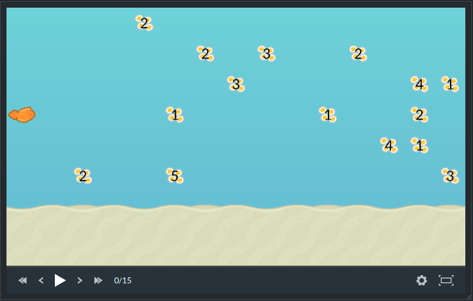

# Getting started

An **Optimization** game is very similar to a **Solo** game. This is why we adapted the example game "Fishy Adventures" to make it an optimization game.

It is suggested to follow the [Solo game creation guide](tutorial-3-solo.md) with the adapted version. The source code is available on GitHub: [https://github.com/CodinGame/game-fishy-adventures/tree/optimization](https://github.com/CodinGame/game-fishy-adventures/tree/optimization)

## What is an Optimization game?

As a Solo game, an Optimization game has test cases. Their purpose here is different as there is a *score* set to the player and a leaderboard. This score should scale in function of how optimized the player's solution is.

Let's take the example of Fishy Adventures:



In the Solo version of this game, the purpose is to collect one egg. Here, there are several groups of eggs with values (the number of eggs in the group) and you cannot gather all of them. You will need to *optimize* the path you take to collect as many eggs as possible. See the [Optimization games features](playground/core-concepts/core-3-game-manager.md#optimization-game-features) for more details.

## Import project

As stated in the Solo guide, you need to download the source code of the game. The Optimization version of the game is located on the `optimization` branch of the repository:
```
git clone https://github.com/CodinGame/game-fishy-adventures.git
cd game-fishy-adventures
git checkout optimization
```

Then, import this project as an existing maven project into your IDE:
- Eclipse: File > Import > Existing Maven Projects
- IntelliJ IDEA: Import Project > Select game-tictactoe > Import project from external model > Maven
