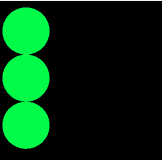
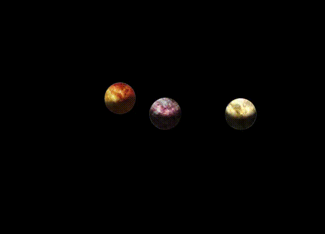

# Graphical Entities

Every sprite, shape, text, etc are entities displayable in the viewer. They implement diverse methods to be manipulated:

- Position
- Rotation
- Anchor
- Scale
- Opacity
- Z index

# Examples

## Creating a circle
```java
// Creates a green circle
Circle circle = graphicEntityModule.createCircle()
			.setRadius(50)
			.setLineWidth(0)
			.setFillColor(0x00FF00)
			.setX(70)
			.setY(70);
```
## Moving a circle
```java
MyPlayer player = gameManager.getPlayer(turn % 2);
circle
	.setX(player.getX())
	.setY(player.getY());
```
### With a Curve
```java
circle
	.setX(player.getX(), Curve.EASE_IN_AND_OUT)
	.setY(player.getY(), Curve.EASE_IN_AND_OUT);
```
By default the `Curve.LINEAR` is used.

It should look like this :

The first circle is not animated,
the second is animated with the default curve
and the last one is animated with the custom curve.

## Creating a group of sprites <a name="creating-a-group-of-sprites"></a>
```java
Sprite planet1 = graphicEntityModule.createSprite()
				.setImage("planet0.png")
				.setAnchorX(0.5)
				.setAnchorY(0.5)
				.setX(-20);
Sprite planet2 = graphicEntityModule.createSprite()
				.setImage("planet1.png")
				.setAnchorX(0.5)
				.setAnchorY(0.5)
				.setX(30)
				.setY(-10);
Sprite planet3 = graphicEntityModule.createSprite()
				.setImage("planet2.png")
				.setAnchorX(0.5)
				.setAnchorY(0.5);

// The planets are around the point (960,540).
Group system = graphicEntityModule.createGroup(planet1, planet2, planet3)
					.setX(960)
					.setY(540);
```

## Spinning a group of spinning sprites around a point
```java
	planet1.setRotation(planet1.getRotation() - Math.PI / 4);
	planet2.setRotation(planet2.getRotation() + Math.PI);
	planet3.setRotation(planet3.getRotation() + Math.PI / 16);
	
	system.setRotation(system.getRotation() + Math.PI / 2);
```
It should look like this :

