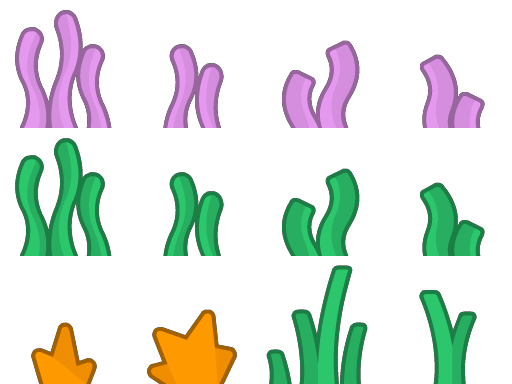
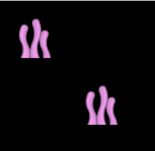

# Loading spritesheets

The Graphic Entity Module can cut and handle spritesheets. There are two ways of doing that.

## Using the SpriteSheetSplitter <a name="SpriteSheetSplitter"></a>

This is the easiest way to create a set of sprites from a spritesheet. This solution is good for prototyping but it is performance costly.

For this example, we will use this spritesheet (taken from our [free to use assets repository](https://github.com/CodinGame/codingame-sdk-assets)):



- 12 images
- 4 images per row
- Each of them is 128px wide and high
- We want to use all the images starting from the top left corner, so the `OrigRow` and `OrigCol` must be set to 0

```java
String[] seaweedSprites = graphicEntityModule.createSpriteSheetSplitter()
    .setSourceImage("spritesheet.png")
    .setImageCount(12)
    .setWidth(128)
    .setHeight(128)
    .setOrigRow(0)
    .setOrigCol(0)
    .setImagesPerRow(4)
    .setName("seaweed")
    .split();

//Creating an animation from the splitted spritesheet
graphicEntityModule.createSpriteAnimation()
    .setImages(seaweedSprites)
    .setX(50)
    .setY(50)
    .setLoop(true);

//Or a sprite from the 1st image of the spritesheet
graphicEntityModule.createSprite()
    .setImage(seaweedSprites[0])
    .setX(250)
    .setY(250);
```

It should look like this :



## Using JSON sprites resources as assets

This method is slightly longer to setup but is more performant. In addition, this allows you to use spritesheets that are not necessarily in a grid layout.

First, you will need to generate a JSON Hash file. We suggest you use [Leshy SpriteSheet Tool](https://www.leshylabs.com/apps/sstool/).

Your file should look like this.

::: sprites.json
```json
{  
   "frames":{  
      "seaweed1":{  
         "frame":{  
            "x":0,
            "y":0,
            "w":128,
            "h":128
         },
         "rotated":false,
         "trimmed":false,
         "spriteSourceSize":{  
            "x":0,
            "y":0,
            "w":128,
            "h":128
         },
         "sourceSize":{  
            "w":128,
            "h":128
         }
      },
      "seaweed2":{  
         "frame":{  
            "x":128,
            "y":0,
            "w":128,
            "h":128
         },
         "rotated":false,
         "trimmed":false,
         "spriteSourceSize":{  
            "x":0,
            "y":0,
            "w":128,
            "h":128
         },
         "sourceSize":{  
            "w":128,
            "h":128
         }
      },
      ⋮
   }
}
```
:::

Place this file in the assets folder, you can now use each image with their name as if they were splitted in different files.