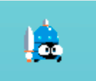

# Animations

Once you have a set of images, you can animate them with a `SpriteAnimation`.

### Example

```java
graphicEntityModule.createSpriteAnimation()
    .setImages(heroSprites)
    .setX(hero.getX())
    .setY(hero.getY())
    .setDuration(100)
    .setLoop(true)
    .setPlaying(true);
```
It should look like this :


- `setImages(heroSprites)`: set a `String` array containing the filenames of the sprites.
- `setX(hero.getX())`, `setY(hero.getY())`: set the position.
- `setDuration(2000)`: set how long the whole animation takes to be played (in milliseconds).
- `setLoop(true)`: if true, the animation will repeat. Otherwise, it will be played only once and the last sprite will remain displayed.
- `setPlaying(true)`: if true, the animation plays if false the animation is paused.`play()` and a `pause()` function also exists to have nice shortcuts.
- You can also reset the progression of the animation with `reset()`
