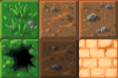

# Advanced use of the Graphic Entity Module

The Graphic Entity Module includes a few advanced features you might need for your game.

## Masks

Masks are used to hide parts of an image. If you have never heard of masks before, we suggest you check [Wikipedia's definition](https://en.wikipedia.org/wiki/Layers_(digital_image_editing)#Layer_mask).

With the Graphic Entity Module, masks can be made of **Shape**, **Sprite** and **SpriteAnimation**. Once your mask created, you can set it to any Entity with `setMask()`.

The behaviour can be different:
- For Sprites as masks: black pixels will hide the Entity, any other pixel will show it.
- For Shapes as masks: the color or the alpha of the shape doesn't affect the mask, all pixels of the shape are considered as a white mask

## Buffered Groups <a name="buffered-groups"></a>

If your game uses tiles, you might experience some artifacts when resizing the viewer.



They appear due to rounding errors. These artifacts can be reduced thanks to `BufferedGroup`. Buffered groups work the same way as `Group`, but the viewer renders its children when they change into a dynamic texture before being displayed. 
⚠**Warnings**⚠
- buffered groups inside buffered groups are not supported and can have unexpected behaviour
- It is not recommended to use a SpriteAnimation in a BufferedGroup
```java
BufferedGroup bufferedGroup = graphicEntityModule.createBufferedGroup();
```
